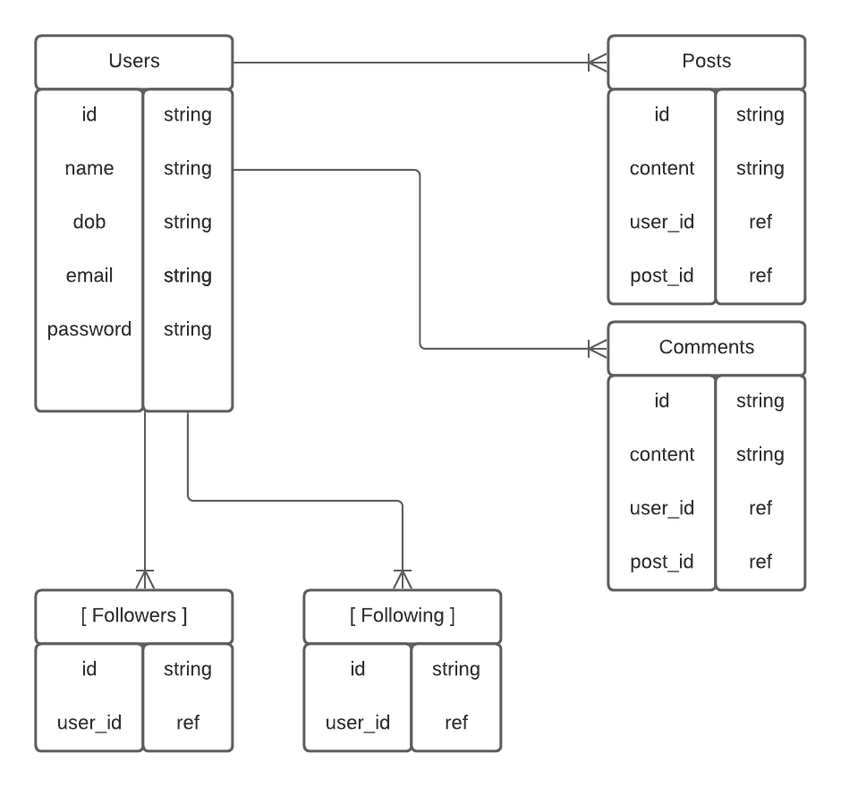
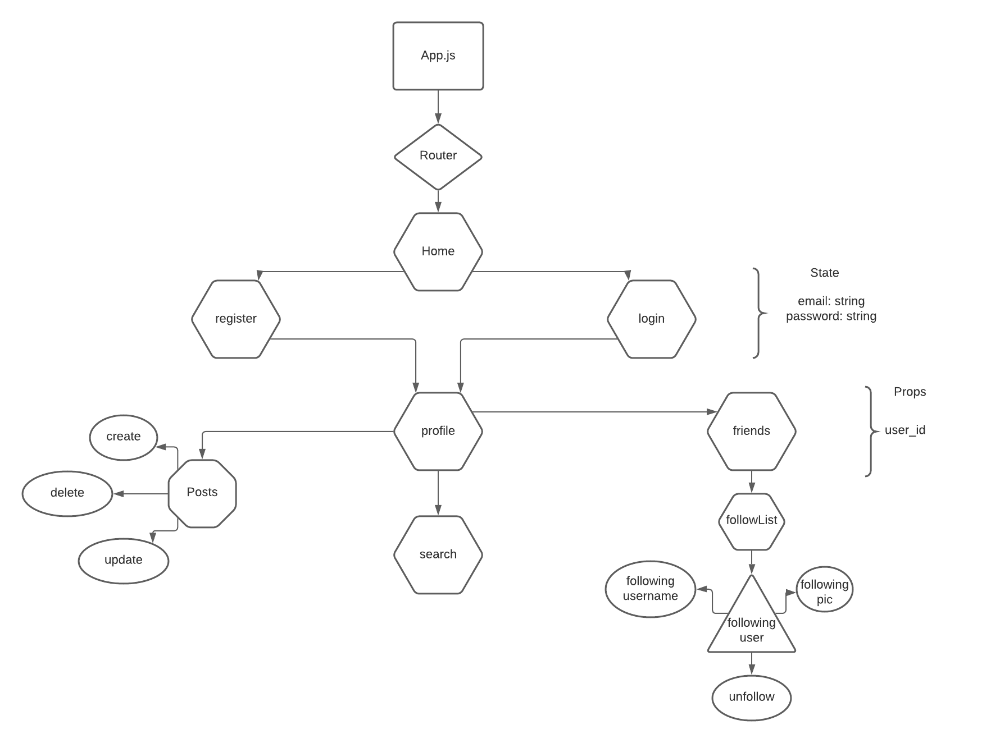
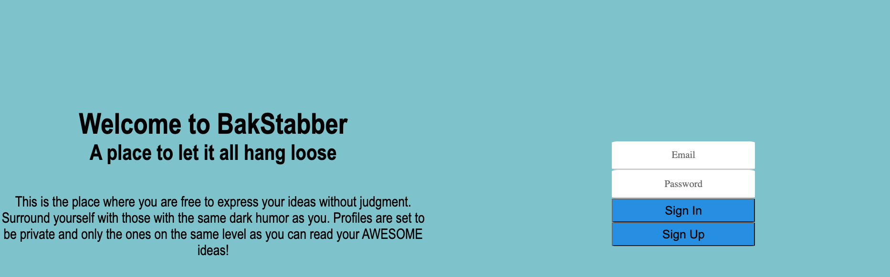
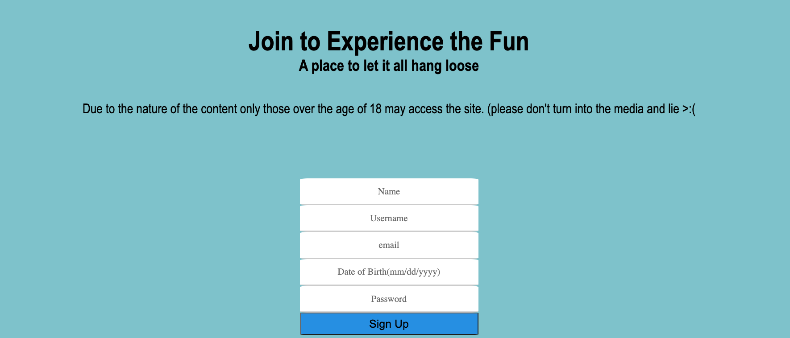
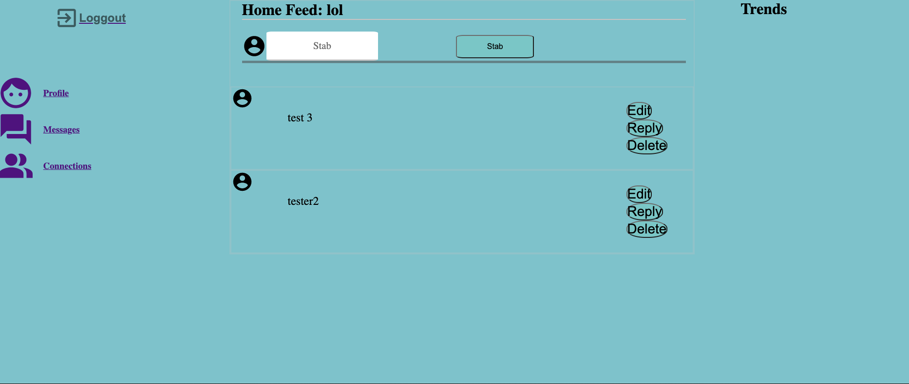
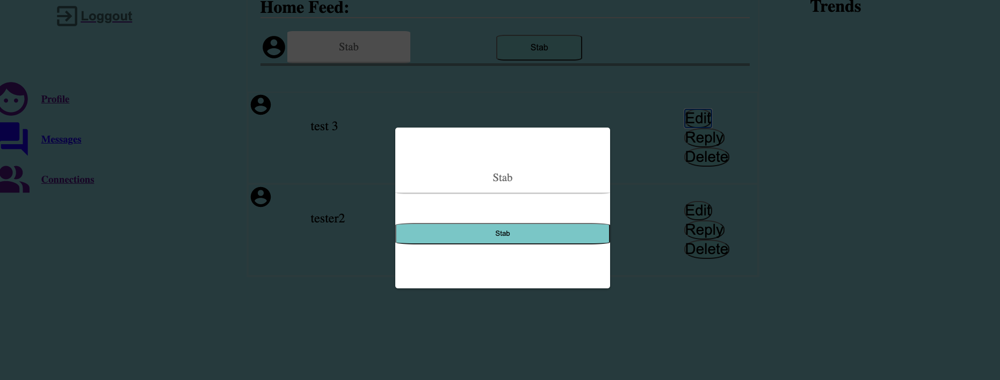
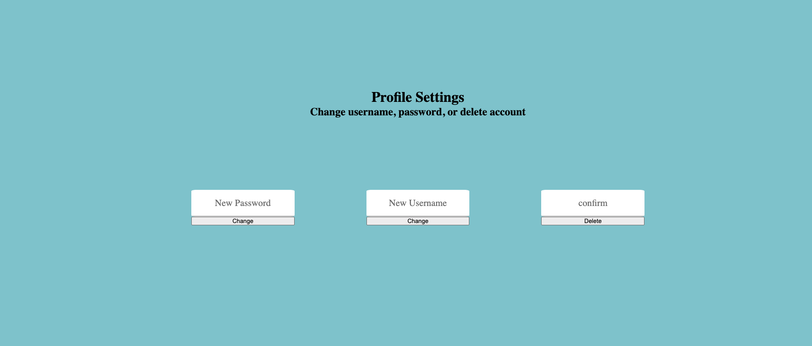

# BakStabbers

## November 9, 2020

### By: Luis Rojas-Huerta

[GitHub](https://github.com/lrojash)
***
<!--  makes line break *** -->
### Overview

The website allows for users to display their true feelings about ideas and subjects, without the judgement from outside viewers. The idea of the site is to function like twitter where any posts that are made are only visible to the user and the followers alike. There is no censorship, nor judgment. Accept only those that can stand your sense of humor and share your ideas. A disclosure is displayed during signup and through the user experience, stating to do their own research with news articles that may be displayed or shared by other users. 

***
### Technonologies Used
<!--  unorder llist * -->
* React
* Express
* Node
* HTML/CSS/JavaScript
* Mongoose
* MongoDB

<!-- diagram the shows relationships between models entity relationship diagram -->

***
### Getting Started

The user will need to create an account to gain access to the site, due to the nature of the content. Upon gaining access the user will be allowed to follow news outlets and search for friends by username. The user will be allowed to like and dislike posts of other users.
### Entity Relationship Diagram

***

### Component Hierarchy Diagram

***
## Screenshots

The user will be welcome to a landing page where a brief intro to the app is given:

If the user does not have an account they can click on the 'Sign Up' button to gain access.

Once logged in the user will be directed to their home page.

.

The user can now add a 'STAB'. (Currently the user can only edit/delete on the most current stab listed on the page. Stay tuned for future updates)

The user also has access to 'Profile', 'Messages', 'Connections'.(stay tuned for updates regarding Messages and Connections)

In Profile the user can modify their settings, password, username, and delete their account.
)
***
### Tracking
[Trello](https://trello.com/b/VO6MigFu/bakstabbers)
***
## Future Updates
 * Messages
 * Search User
 * Connections
 * Replies
 * Specific 'stab' functionality

<!-- ***  -->
<!-- ### Screenshots
{} -->
<!-- *** -->
<!-- ### Future updates/ post mvp/ planned imporvements / stretch goals -->
<!-- ~~text~~ strike through -->
<!-- *** -->
<!-- ### Credits
all things that were not self created
* background image:
* CSS Library: []
* Api -->

